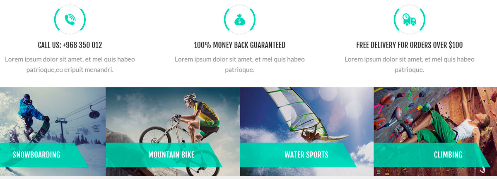

---
title: Catalog
uid: en/running-your-store/catalog/index
author: git.AndreiMaz
contributors: git.exileDev, git.dunaenko, git.IvanIvanIvanov, git.mariannk, git.DmitriyKulagin
---

# Catalog

Products are the basis of an online store, and product management is a very important part of your store management strategy. Product information helps customers decide whether they want to purchase an item or not. So make sure to have quality product content in the store because it builds your customers' confidence that they are getting exactly what they need and expect.

The most important components of product management in nopCommerce are adding products, manufacturers, setting up product categories to make navigation easy, adding good product descriptions and appealing pictures, listing all possible product variants, defining product tags to make product search quick and effective.

## A catalog on the example of a live store

In the following examples, we will use our demo store based on the "Nop Venture Theme" by Nop-Templates. Please find more about this third-party theme [here](https://www.nopcommerce.com/nop-venture-theme-14-plugins-nop-templatescom).

There are some tips to help you create a well-designed catalog for your customers.

### Categories

- When adding categories to your store, ensure they clearly describe the products (or subcategories) they contain. As on the following example, the Boards category only contains boards:
 
 *Create categories using the **Add new** button on the **Catalog → Categories** page*.

- Use subcategories when you need to divide a general category into specific ones. It makes the search process easier for your customers. As on the example below, the Water Sports category contains the Surf, Windsurf, and Kitesurf
subcategories:
 
 *Add the **Parent category** on the category edit page to turn it into a subcategory.*

- Add the most popular categories to the top menu, which is visible on each page, to attract more customers:
 
 *To do this, use the **Include in top menu** checkbox on the category edit page.*

- Add the most interesting categories to the home page. These categories will be first what a customer sees when visiting your store:
 
 *To do this, use the **Show on home page** checkbox on the category edit page.*

- Allow your customers to search in categories using filters:
 
 *The filter functionality uses [specification attributes](xref:en/running-your-store/catalog/products/specification-attributes).*

- Allow your customers to sort products and change the display mode:
 
 *For more information about sorting, visit the [Catalog settings - Product sorting](xref:en/running-your-store/catalog/catalog-settings#product-sorting) section. Use the **Allow customers to select page size** and **Page size options** fields from the category edit page to set up the display mode.*

To learn how to create a category, visit the [Categories](xref:en/running-your-store/catalog/categories) chapter.

## See also

- [Categories](xref:en/running-your-store/catalog/categories)
- [Manufacturers](xref:en/running-your-store/catalog/manufacturers)
- [Attributes](xref:en/running-your-store/catalog/products/product-attributes)
- [Products](xref:en/running-your-store/catalog/products/index)
- [Catalog settings](xref:en/running-your-store/catalog/catalog-settings)
