---
title: Reports
uid: en/running-your-store/reports
author: git.AndreiMaz
contributors: git.exileDev, git.mariannk
---

# Reports

Reports are important for management; they allow for monitoring store's performance, tracking key metrics, and supporting decision-making. nopCommerce reports provide access to sales and customer information.

## Dashboard

The dashboard is the first page you see when accessing the admin area. It enables you to view your store statistics, including the total number of orders processed over the chosen period (year, month, week), registered customers, low-stock products, and the most popular products in your store.

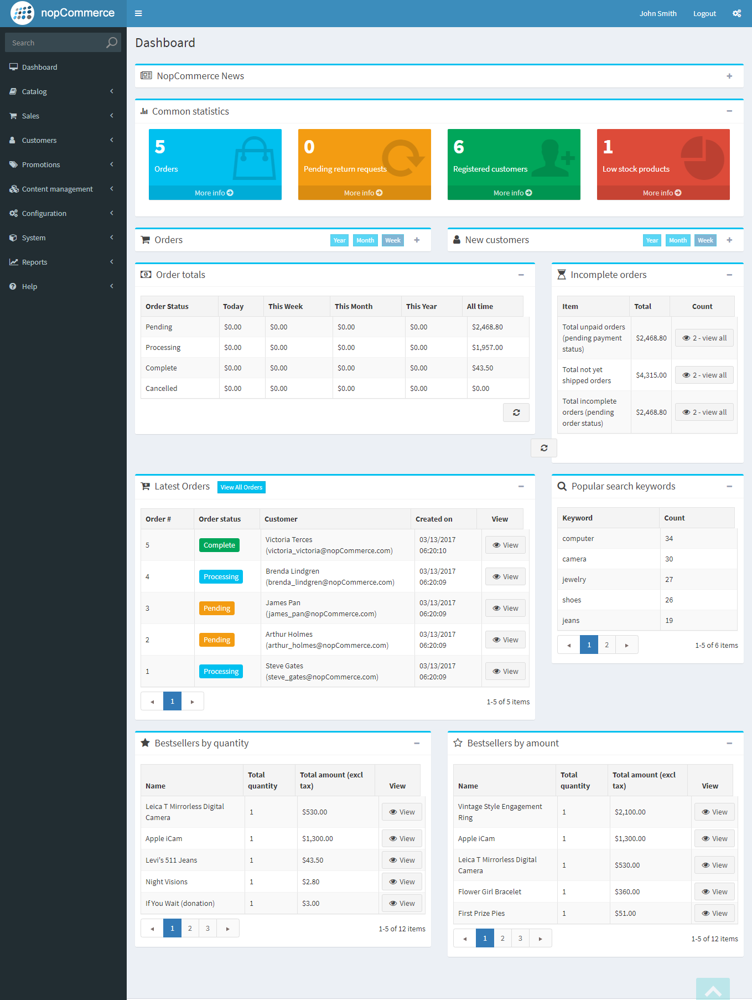

The dashboard consists of several blocks:

### nopCommerce news

Displays general nopCommerce news like new version releases.

### Common statistics

Here, you can find links to more detailed reports:

- Sales → Orders
- Sales → Return requests
- Customers → Registered customers
- Reports → Low stock

### Orders

This diagram shows the number of orders processed in the last week, month, year.
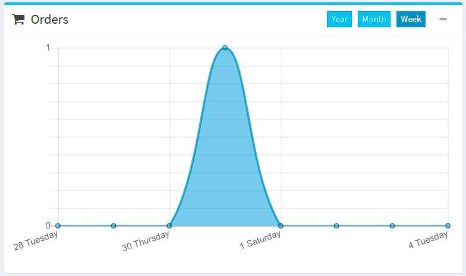

### New customers

This diagram shows the number of customers registered in the last week, month, year.
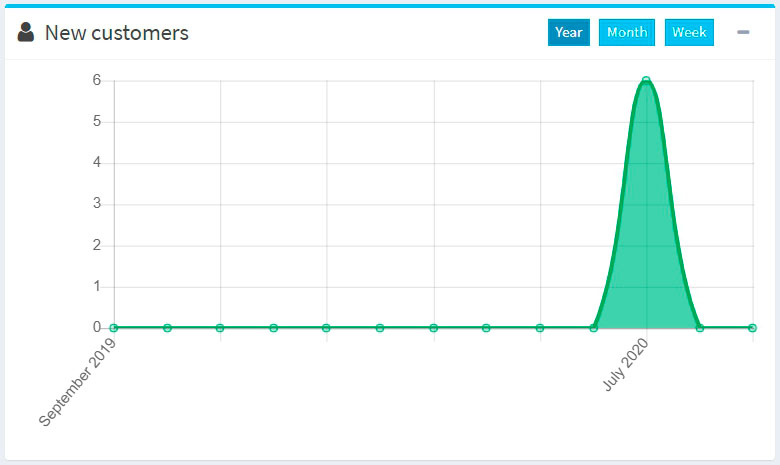

### Order totals

This section shows the total of orders processed in the last day, week, month, year. Orders are shown by order status.
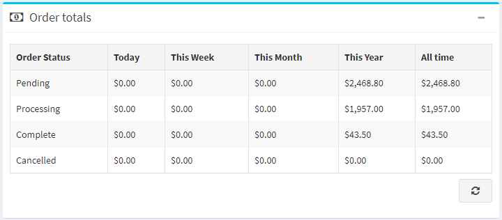

### Incomplete orders

This section shows the number of orders that are currently incomplete.
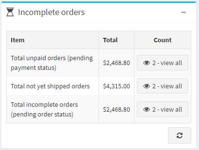

### Latest orders

The Latest orders section shows you the latest placed orders.
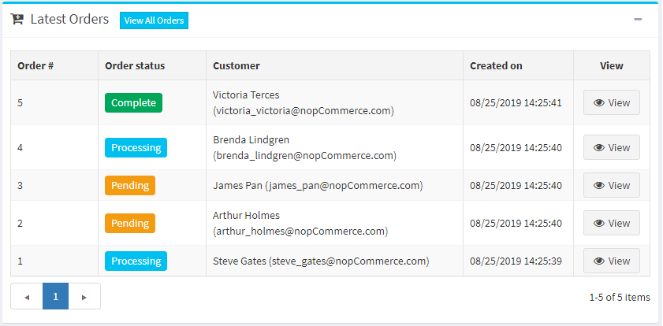

### Popular search keywords

This block displays the most used keywords.

### Bestsellers reports

This section displays the bestsellers by quantity and by amount.

## Sales summary

This report represents the total orders summary. To generate a report, you can use the following filters:

- **Start date** for the search.
- **End date** for the search.
- **Order status** to search by a specific order status, for example, "Complete."
- **Payment status** to search by a specific payment status, for example, "Paid."
- **Category** to search in a specific category.
- **Manufacturer** to search by a specific manufacturer.
- **Billing country** to filter by order billing country.
- **Vendor** to search by a specific vendor.
- **Product** to search by a specific product.
- **Group by** for grouping by time periods. When this option is set to "Day," it will display a list of dates for a selected period (start/end date). For example, "Nov 8th, 2020," "Nov 7th, 2020," etc. When it is set to "Week", it will display a list of weeks (for example, "December 7th, 2020 - December 12th, 2020," etc.). When it is set to "Month", it will display a list of months (for example, "December 2020," "November 2020," etc.).

Then click **Run report**.

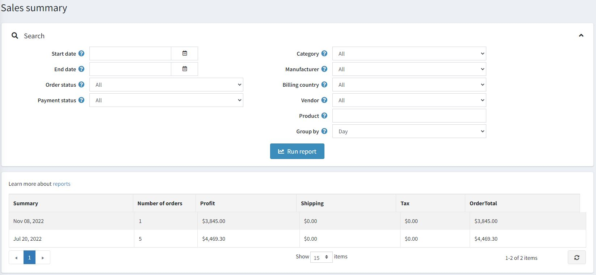

## Low stock report

A low stock report contains a list of products currently under stock. In the example shown below, the min stock quantity was set to 20, and the stock quantity is 0; therefore a low stock report is generated for this product. You can set up low stock settings when adding the product.

To view low stock reports, go to **Reports → Low stock**. The *Low stock* report window will be displayed as follows:
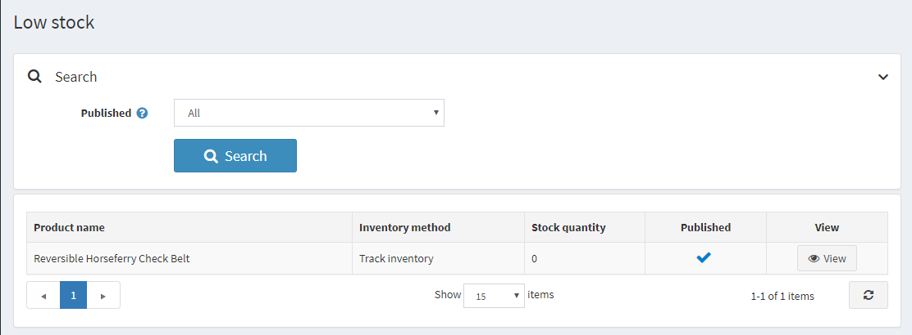

The low stock reports can be filtered by the **Published** property, which represents the *Published* property of products.

In the displayed table, click **View** to view the product details page where the stock quantity can be updated.

## Bestsellers and never purchased

Knowing the best-selling products and products never purchased is essential for any shop owner.

First of all, this can help in making better purchasing decisions: you can scale up on your popular items and exclude unpopular ones from your product list. When analyzing, consider, for example, whether certain colors sell faster or whether your product sales depend on a season.

Secondly, defining most and least selling goods can help you *re-evaluate product design and marketing*. Maybe your best items go faster just because of their placement in your webstore or better description. Come up with various options and test them. To do it more effectively, engage with your customers. *Conduct various surveys* to find out why the best-selling items are preferred, what makes them special for your buyers. Use the insights to improve your marketing and increase sales.

### Bestsellers

To view bestsellers in nopCommerce, go to **Reports → Bestsellers**. Enter one or more of the following search criteria to run the report:

- **Start date** and/or **End date**.
- **Store** if you want to select one of your stores.
- **Order status**, such as *All*, *Pending*, *Processing*, *Complete* or *Cancelled*.
- **Payment status**, such as *All*, *Pending*, *Authorized*, *Paid*, *Refunded*, *Partially refunded* or *Voided*.
- Choose the **Category**.
- Choose the **Manufacturer**.
- Choose the **Billing country**.
- Choose the **Vendor**.

Then click **Run report**.

The report will break down your best-selling products based on both units sold and revenue:

### Products never purchased

To view products never purchased, go to **Reports → Products never purchased**. Enter one or more of the following search criteria to run the report:

- Choose the **Category**.
- Choose the **Manufacturer**.
- **Store** if you want to select one of your stores.
- Choose the **Vendor**.
- **Start date** and/or **End date**.

Then click **Run report**.

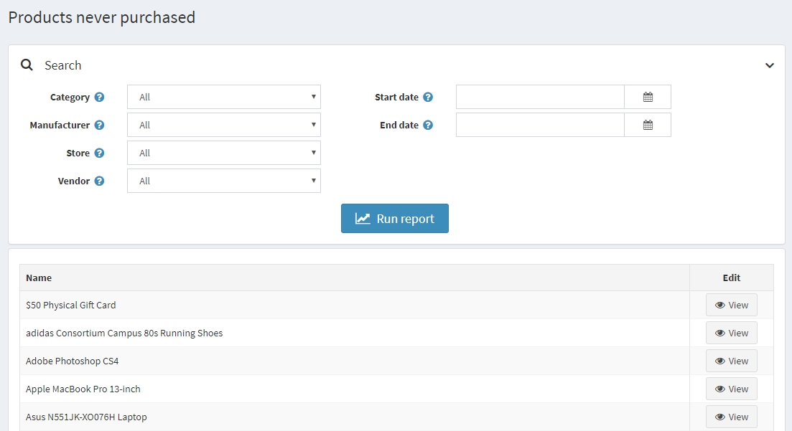

## Country sales

A country report contains a list of orders that includes the number of orders and the total order sum in each country. This enables store owners to view the orders per country.

To view a country sales report, go to **Reports → Country sales**.

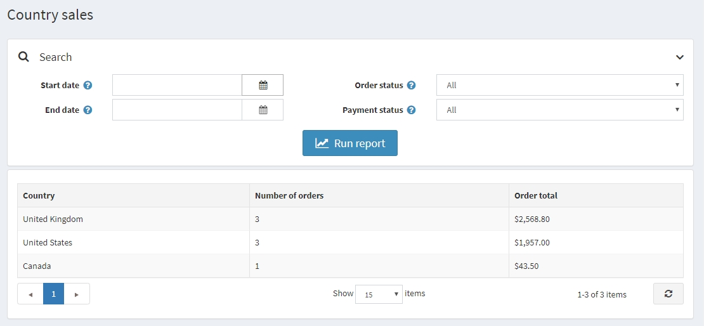

To set up the report, enter one or more of the following search criteria:

- **Start date** for the search.
- **End date** for the search.
- **Order status**, such as *All*, *Pending*, *Processing*, *Complete* or *Cancelled*.
- **Payment status**, such as *All*, *Pending*, *Authorized*, *Paid*, *Refunded*, *Partially refunded* or *Voided*.

Then click **Run report**.

## Customer reports

Customer reports give a store owner general information about registered customers and their orders. You can find various reports in the **Reports → Customer reports** menu.

### Registered customers

To run this report, go to **Reports → Customer reports → Registered customers**.
This report displays the number of registered customers for a certain period.
You can track the number of users registered within the last day, week, two weeks, month, and year.

### Customers by order total

To run this report, go to **Reports → Customer reports → Customers by order total**.
In this report, you can see the order totals spent and number of orders made by customers.

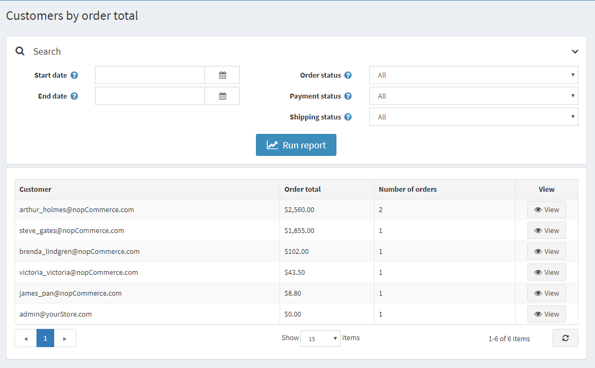

Enter one or several search criteria to compile a report:

- Registration **Start date**.
- Registration **End date**.
- **Order status**, such as *All*, *Pending*, *Processing*, *Complete* or *Cancelled*.
- **Payment status**, such as *All*, *Pending*, *Authorized*, *Paid*, *Refunded*, *Partially refunded* or *Voided*.
- **Shipping Status**, such as *All*, *Shipping not required*, *Not yet shipped*, *Partially shipped*, *Shipped*, *Delivered*.

Then click **Run report**.

### Customers by number of orders

To run this report, go to **Reports → Customer reports → Customers by number of orders**.
This report displays the top 20 customers based on the total number of orders issued.

Enter one or several search criteria to compile a report:

- Registration **Start date**.
- Registration **End date**.
- **Order status**, such as *All*, *Pending*, *Processing*, *Complete* or *Cancelled*.
- **Payment status**, such as *All*, *Pending*, *Authorized*, *Paid*, *Refunded*, *Partially refunded* or *Voided*.
- **Shipping Status**, such as *All*, *Shipping not required*, *Not yet shipped*, *Partially shipped*, *Shipped*, *Delivered*.

Then click **Run report**.

## Tutorials

- [Running reports in nopCommerce](https://www.youtube.com/watch?v=IbfoppTG9tM)
